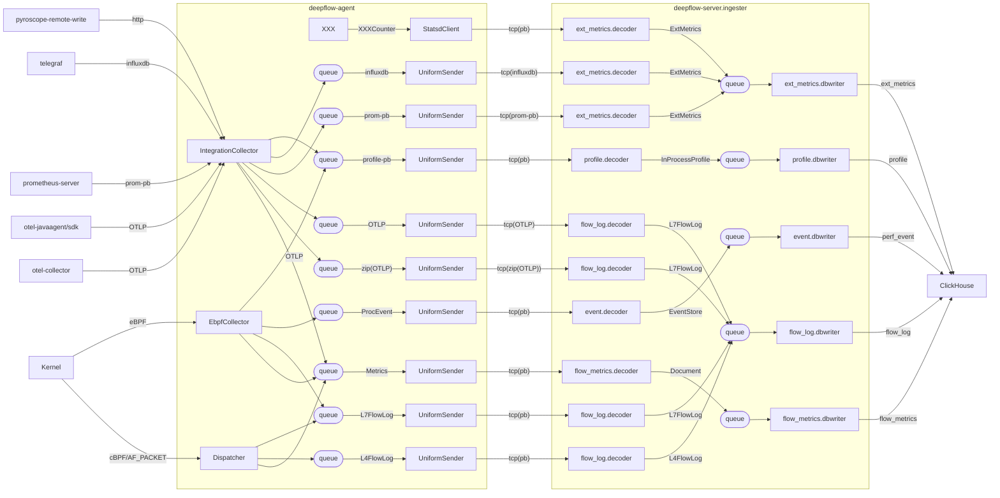
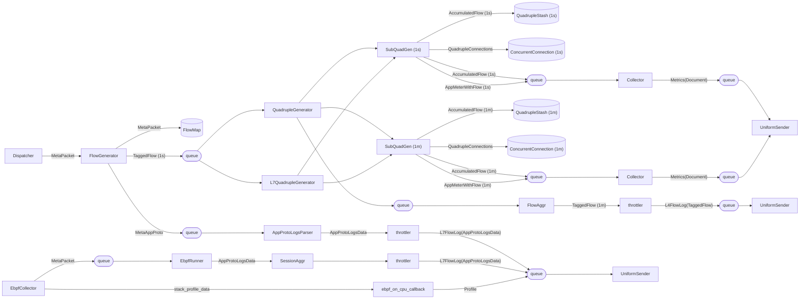
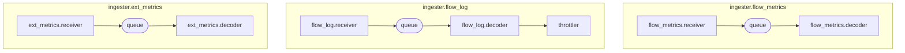
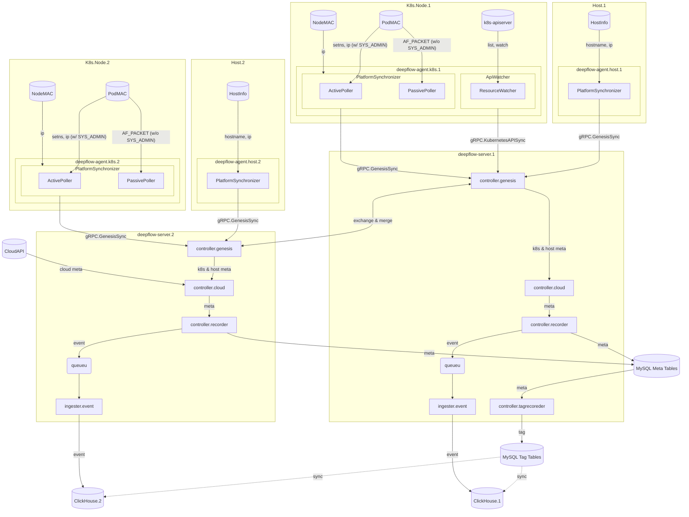
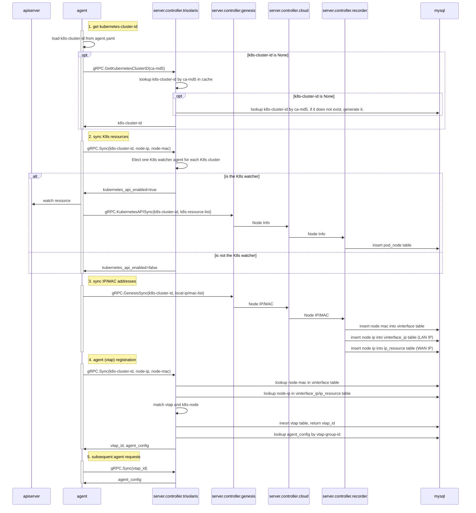
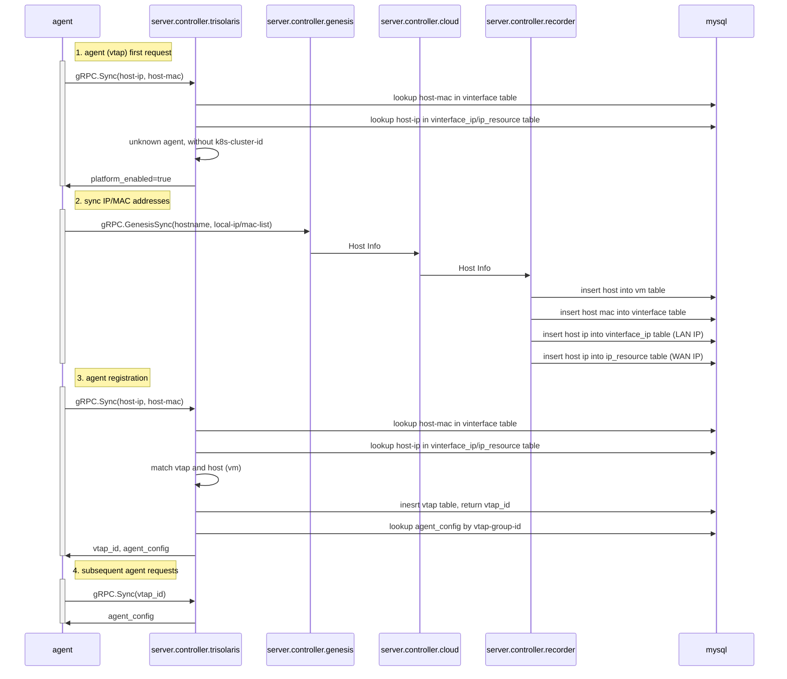

以下内容基于 DeepFlow 的官方文档 (docs/design/data-flow.md) 以及其在 GitHub 的代码结构 (如 agent/src/collector/、server/ingester/ 等) 展开，帮助你理解其核心数据流向与处理流程。

--------------------------------------------------------------------------------
## 1. 总体思路

DeepFlow 的目标是提供一套“零侵入”、可同时覆盖网络、应用、主机等全域可观测数据的解决方案。它由两大核心组件组成：  
• Agent：部署在各节点（包括 K8s Node、虚机、物理主机）上，用于采集并汇总网络流量、eBPF 数据、第三方指标输入 (Prometheus、OTLP 等)。  
• Server：部署在中心侧，提供管理、标签注入 (Tagging)、数据解码 (Decoder)、持久化 (DBWriter) 等功能。  

Agent 与 Server 之间会进行 gRPC 交互，并配合消息队列或直接 TCP 传输，把各种类型的数据（指标、流量日志、事件、Profiling 等）送到后端统一存储 (ClickHouse、MySQL 等)。  

--------------------------------------------------------------------------------
## 2. Agent 数据采集流程

在 docs/design/data-flow.md 的第一部分“Data Collection”里，使用了多张 mermaid 图来说明从 Agent 到 Server 的数据流转过程。

1) (图示“from Dispatcher/EbpfCollector to UniformSender”)  
   - Agent 核心采集模块包括：  
     • Dispatcher：从 Kernel 层获取原始数据包 (AF_PACKET / cBPF)。  
     • EbpfCollector：基于 eBPF 获取更丰富的网络和应用过程信息，比如 Socket、进程信息、调用栈 (Profiling) 等。  
   - 收集到的原始数据首先会经过多个队列 (queue.1, queue.2, …)，再由 QuadrupleGenerator、FlowGenerator 等组件对数据做“流聚合”。  
   - 对 L4/L7 流量指标会分别生成 Metrics、Log，不同的数据类型会送往不同的 UniformSender，最后以远程调用 (tcp + protobuf/OTLP/influxdb 等格式) 发给 DeepFlow Server 端的 ingester 模块。  
   - 对第三方数据 (IntegrationCollector) 也会经过相似的队列和 UniformSender 流程，包括：  
     • OTLP (可来自 OTEL Collector、JavaAgent 等)  
     • Prometheus 或 InfluxDB 协议 (prom-pb / influxdb)  
     • Pyroscope Profiling (profile-pb)  
     • StatsD 之类的统计指标 (statsdClient -> ext_metrics.decoder)  

2) 不同类型数据在 Agent 端合流：  
   - 流量编码：FlowGenerator、QuadrupleGenerator 等将 L4, L7 流量转为可观测指标。  
   - Profiling 数据：eBPF 获取 CPU、内存、网络等函数栈信息，通过队列 (queue.9) 走 UniformSender -> profile.decoder -> profile.dbwriter。  
   - 事件信息 (ProcEvent / Tracing / etc.)、应用日志信息 (IntegrationCollector) 等，也同样通过队列归一化后，发送到 Server 的 ingester.xxx 模块。  

--------------------------------------------------------------------------------
## 3. Server 端 ingester 处理流程

Server 侧的 ingester 模块 (docs/design/data-flow.md 中 “Decoders In deepflow-server.ingester” 一节) 主要包括以下解码器和数据库写入器：  
• flow_metrics.decoder & flow_metrics.dbwriter：接收 Agent 发来的网络指标 (Metrics)，写入 ClickHouse 的 flow_metrics 表。  
• flow_log.decoder & flow_log.dbwriter：接收并解析各类 L4/L7 流日志，写入 ClickHouse 的 flow_log 表。  
• ext_metrics.decoder & ext_metrics.dbwriter：处理来自 Prometheus、Telegraf 等外部数据源传过来的业务指标数据 (ExtMetrics)，写入 ClickHouse 的 ext_metrics 表。  
• event.decoder & event.dbwriter：写入与主机 / K8s / 网络事件相关的信息。  
• profile.decoder & profile.dbwriter：解析 agent 传来的 Profiling 数据 (如调用栈、eBPF Profiling 等)，写入 ClickHouse 的 profile 表。  

简而言之，Agent 从各种数据源收集到的多种信息会分别进入对应的 decoder 进行解码和关联，然后写入相应的 ClickHouse 表进行持久化存储。

--------------------------------------------------------------------------------
## 4. 元数据采集与标签注入

DeepFlow 还很注重元数据 (Meta) 的采集 —— 包括 K8s、云平台、主机信息等，用以丰富各种观测数据的上下文信息。“Meta Collection”部分的 mermaid 图做了如下强调：  
1) Agent 会主动去采集本机节点、K8s APIServer、云平台 API 等信息，或通过“ActivePoller / PassivePoller”的方式获取 Pod IP、MAC、Node IP、MAC 等。  
2) 服务器端通过 genesis (controller.genesis)、cloud (controller.cloud)、recorder (controller.recorder) 等组件互相配合：  
   - genesis 模块聚合多来源元数据；  
   - cloud 模块做云平台信息处理、拓扑发现；  
   - recorder 模块将元数据写入 MySQL（meta 表和 tag 表）。  
3) 最终，这些存入 MySQL 的元数据会被同步到标签系统，或定时同步到日志存储 (ClickHouse) ，用来给各类相应的流量日志、指标打上 (k8s namespace, pod, 主机名, 业务属性等) 关联标签。

--------------------------------------------------------------------------------
## 5. Agent 注册及管理

在 DeepFlow 中，每个 Agent 需要和 Server 做注册，以确定其在系统中的唯一标识 (vtap_id)。文档中专门有“Agent on K8s Node”与“Agent on Legacy Host” 的注册时序图：

• K8s 节点的 Agent：  
  1) Agent 首次启动时，如果本地没有 k8s-cluster-id，会向 server.controller.trisolaris 询问。  
  2) 如果被选为 “K8s watcher”，则需要 watch K8s APIServer 并把资源信息上报给 controller.genesis -> controller.cloud -> MySQL。  
  3) 继续发送 gRPC.GenesisSync() 来同步 IP/MAC、主机信息等；后端再在 MySQL 中查找 / 插入相应记录，与 vtap 表关联，返回 vtap_id。  
  4) 之后 Agent 只需带着 vtap_id 进行后续心跳 / 配置同步。

• 传统主机 (Legacy Host) 的 Agent：  
  1) 没有 k8s-cluster-id 的概念，只需要第一次向 server.controller.trisolaris 上报 host-ip, host-mac。  
  2) 服务器端组件也会将这些信息入库 (vm 表、vinterface、ip_resource 等)。  
  3) 服务器为其分配 vtap_id 后，Agent 就可以后续带着这个 ID 继续执行 Sync() 心跳，并获取 agent_config。

--------------------------------------------------------------------------------
## 6. 小结

通过以上流程，DeepFlow 在 Agent 侧接入各种数据源（内核流量、应用层协议数据、eBPF Profiling、第三方监控指标等），统一编码后发送到 Server 侧的 ingester 进行解码、入库，再配合更上层的管理/控制模块完成对 K8s、主机或云平台元数据的关联和标签化。最终，这些数据会被持久化在 ClickHouse 和 MySQL 中，并在可视化界面或其他查询 API 中提供分析与检索。

如果你需要查看更多细节，可以参见以下链接：  
• DeepFlow 仓库: [deepflowio/deepflow](https://github.com/deepflowio/deepflow)  
• 详细设计文档: [docs/design/data-flow.md](https://github.com/deepflowio/deepflow/blob/main/docs/design/data-flow.md)

这就是项目在你所关心的可观测数据流向方面的整体脉络，希望能帮你更好地理解 DeepFlow 的实现思路。若还需更深入的技术细节，如各个 Decoder 的字段处理逻辑，可在库中查看具体源码 (比如 server/ingester/flow_log/log_data/、server/ingester/flow_metrics/、agent/src/collector/等)。祝你研读愉快！

# overview

## From Dispatcher/EbpfCollector to UniformSender

## Decoders In deepflow-server.ingester

## Meta Collection

# Agent Registration

## Agent on K8s Node

## Agent on Legacy Host

