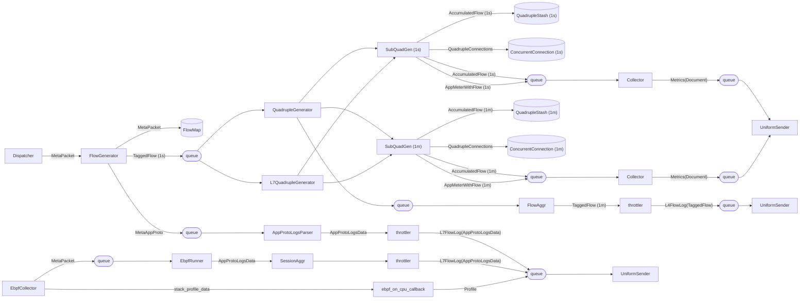

简单记录一下Deepflow Agent的采集流程的数据流

*<!--more-->*

# 架构

a)程序信息，如进程ID、线程ID、协程ID、进程名

b)网络信息，如全局socket id、五元组、TCP Sequence（代表已发送字节数）

c)Tracing信息，如timestamp，ingress/egress 方向

d)系统调用信息，如读/写数据长度、传给deepflow agent的payload等

a)cBPF用于记录网络流量

b)uprobe记录用户空间数据，如TLS加密前流量

c)其它监控系统数据，如OpenTelemetry

# 数据采集

# Dispatcher

是核心采集器，Deepflow通过AF_PACKET/cBPF采集到原始的数据包

1. BaseDispatcher::recv()接收包
2. 缓存到vec，最多64个包
3. 达到容量触发发送，批量发送到"dispatcher-packet-to-flow-generator"线程，循环做如下操作
   1. Decap tunnel
   2. Lookup l2end
   3. Generate MetaPacket
   4. Generate tagged flow，通过调用 flow_map.inject_meta_packet(&config, &mut meta_packet)实现
4. 进入flow generator

## packet处理

# flow generator

这里对采集的的数据包进行聚合生成tagged_flow，解析生成l7 perf、AppLog等

1. 数据包解析，提取各层协议的信息
2. 使用（源IP地址、目的IP、源端口、目的端口、协议）来定义和识别流
3. 将属于同一流的数据包进行聚合

4. 这里会调用plugin来对用户层协议进行解析比如mysqlLog

# QuadrupleGenerator

生成秒级flow meter、汇聚成分钟级meter、发送至deepflow server数据平面。共四个线程:

1.quadruple_generator: QuadrupleGeneratorThread=>生成秒级flow meter
2.l4_flow_aggr: Option<FlowAggrThread>=>秒级flow meter汇聚成minute meter
3.second_collector: Option<Collector>=>秒级meter收集，并发送至deepflow server数据平面
4.minute_collector: Option<Collector>=》分钟级meter收集，并发送至deepflow server数据平面

# EbpfCollector

采集socket的追踪

采集tls

采集SSL

Reference: https://zhuanlan.zhihu.com/p/713489970